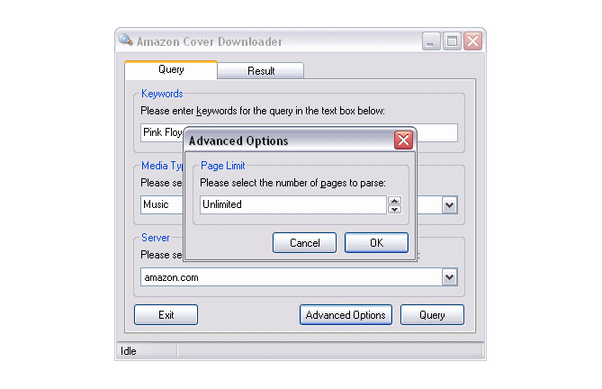



## Amazon Cover Downloader

### Description

ACD, short for Amazon Cover Downloader, is a free application licensed under the terms of the BSD license for downloading CD and DVD covers from the Amazon product catalog.

The program supports two operation modes: a silent mode which does not display windows and relies solely on command line arguments, and an interactive mode that allows you to enter the query-related information inside a form, displays all results as thumbnails and lets you select which image to download.

Please read the "Readme.rtf" file for additional information.
 
### More Info
 

             |
---                |---
**Submitted On**   |2006-02-09 07:01:20
**By**             |[Sebastian Mares](https://github.com/Planet-Source-Code/PSCIndex/blob/master/ByAuthor/sebastian-mares.md)
**Level**          |Intermediate
**User Rating**    |5.0 (25 globes from 5 users)
**Compatibility**  |VB 6\.0
**Category**       |[Complete Applications](https://github.com/Planet-Source-Code/PSCIndex/blob/master/ByCategory/complete-applications__1-27.md)
**World**          |[Visual Basic](https://github.com/Planet-Source-Code/PSCIndex/blob/master/ByWorld/visual-basic.md)
**Archive File**   |[Amazon\_Cov197128292006\.zip](https://github.com/Planet-Source-Code/sebastian-mares-amazon-cover-downloader__1-64229/archive/master.zip)

